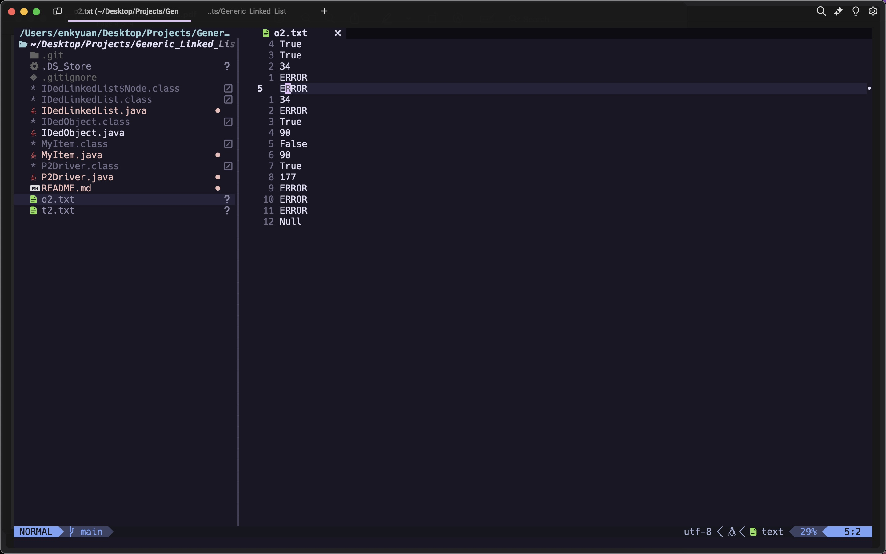

# Generic Linked List

## Project Description

This is an implementation of a generic linked list (as the title states) that uses a txt file to output values based on function calls, i.e., addToFront, deletion, etc. Files should contain 'items' (nodes) with id values, prices, and descriptions separated by whitespace.  

## Java Version

```shell
openjdk version "23" 2024-09-17
```

## Usage

```shell
javac P2Driver.java
java P2Driver t2.txt o2.txt
```

> first parameter is a text file with test case and result is outputted to the second parameter

## Sample Output



> output corresponds to sample shell commands to test code
